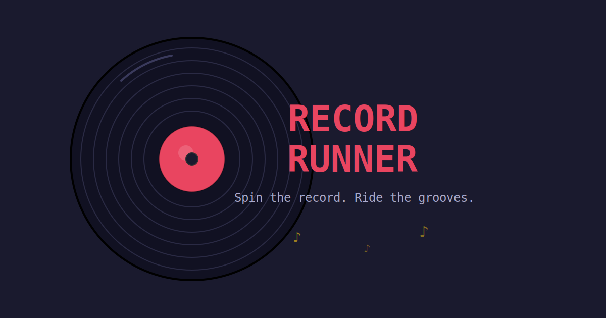

# 🎵 Record Runner

A vinyl-themed puzzle platformer where you spin a record to guide a guitar pick through procedurally generated levels. Drag to rotate, use gravity and momentum to navigate platforms, collect notes, avoid hazards, and reach the center of each record.

**[Play it live →](https://record-runner.vercel.app)**



---

## Summary

Record Runner is a fully client-side browser game with zero static art or audio assets. All visuals are procedurally drawn at runtime in a cel-shaded style. Music is synthesized in real-time, with each level producing a unique track derived from its thematic context. Levels are procedurally generated with guaranteed playability.

The core mechanic is a physics puzzle: the player character sits on a spinning vinyl record that you control by dragging. Gravity, momentum, slope traction, and timing determine whether you make it from the outer groove to the center label.

6 records, 34 tracks — from gentle introductions to expert-level gauntlets.

---

## Features

- Spin-to-play mechanic with momentum and friction
- Procedural level generation with reachability guarantees
- Cel-shaded procedural art — all textures generated at runtime
- Procedural music engine — unique looping tracks per level
- Physics-based platforming with slope traction and sliding
- 6 records / 34 tracks with progressive difficulty
- Power-ups: Freeze, Slow, Fast — rare and permanent per level
- High score system with input sanitization
- Level selector with tracklists and difficulty indicators
- Admin level builder with AI-driven generation and visual editing
- Mobile support with responsive scaling and touch controls
- Social sharing with Open Graph and Twitter Card meta tags

---

## Architecture Overview

```
┌──────────────────────────────────────────────────────┐
│                   Browser Client                      │
│                                                      │
│  ┌────────────────────────────────────────────────┐  │
│  │              Game Engine (Phaser 3)             │  │
│  │  Physics • Scenes • Rendering • Input • Scale  │  │
│  └────────────────────┬───────────────────────────┘  │
│                       │                              │
│  ┌────────┬───────────┼───────────┬──────────────┐  │
│  │ Level  │ Procedural│  Core     │   Score      │  │
│  │ Gen    │ Music     │ Gameplay  │   System     │  │
│  │(Seeded)│(Web Audio)│ (Physics) │ (Client-side)│  │
│  └────────┴───────────┴───────────┴──────────────┘  │
│                                                      │
│  ┌────────────────────────────────────────────────┐  │
│  │         Admin Dashboard (Level Editor)         │  │
│  │  AI Generation • Visual Editor • Validation    │  │
│  └────────────────────────────────────────────────┘  │
└──────────────────────────────────────────────────────┘
                         │
                         ▼
┌──────────────────────────────────────────────────────┐
│              Deployment (CI/CD → CDN)                 │
│         Git push → Build → Static hosting            │
└──────────────────────────────────────────────────────┘
```

A detailed architecture diagram is available at [`docs/architecture.svg`](docs/architecture.svg).

---

## Tech Stack

| Layer | Technology | Purpose |
|-------|-----------|---------|
| Game Engine | Phaser 3 | Scene management, physics, input, rendering |
| Build Tool | Vite | Bundling, dev server, multi-page support |
| Audio | Web Audio API | Real-time procedural music synthesis |
| Rendering | Canvas / Graphics API | Procedural cel-shaded texture generation |
| State | Client-side storage | Score persistence with input sanitization |
| Deployment | Vercel | CI/CD, static hosting, CDN |
| Version Control | GitHub | Source repository |

---

## Key Technical Highlights

**Procedural everything** — All visuals, audio, and level layouts are generated at runtime. No sprite sheets, no audio files, no hand-placed levels. The entire game source (excluding the engine) is under 15KB.

**Physics-driven rotation** — Platforms move via velocity rather than teleporting, allowing the physics engine to properly resolve collisions during record rotation. Rotation is sub-stepped to prevent tunneling through geometry.

**Name-driven music** — The music engine maps keywords from level and record names to musical scales, waveforms, bass patterns, rhythm densities, and pad layers, producing thematically appropriate tracks for each level.

**Slope mechanics** — Platforms have limited traction. Beyond a threshold tilt angle, the player slides along the slope direction, adding a layer of physics puzzle to the rotation mechanic.

---

## Running Locally

```bash
npm install
npm run dev
```

---

## License

MIT
